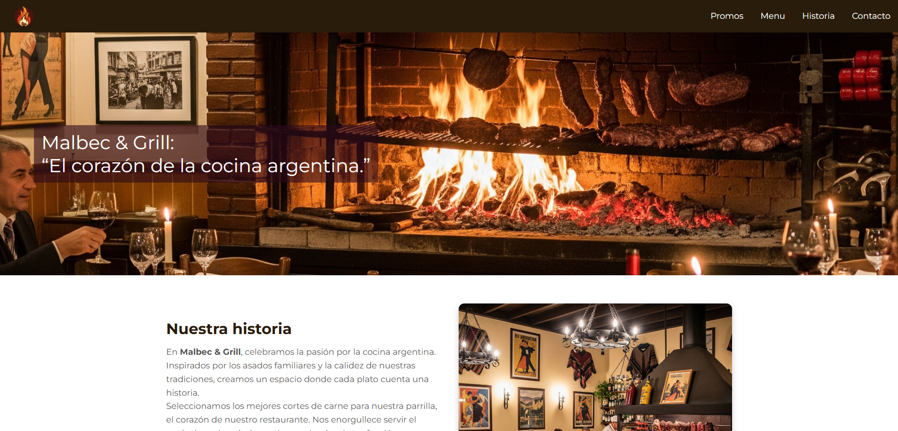
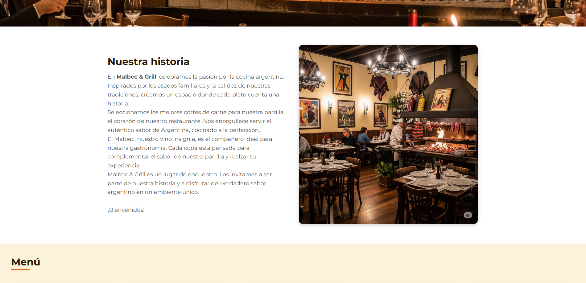
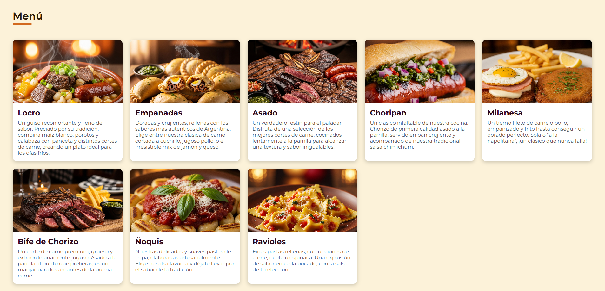
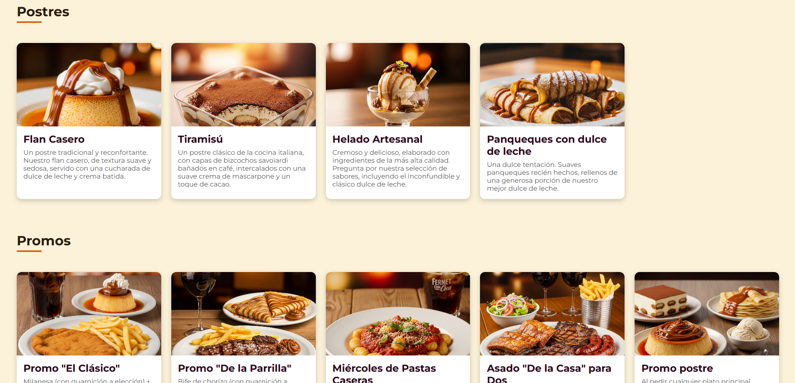
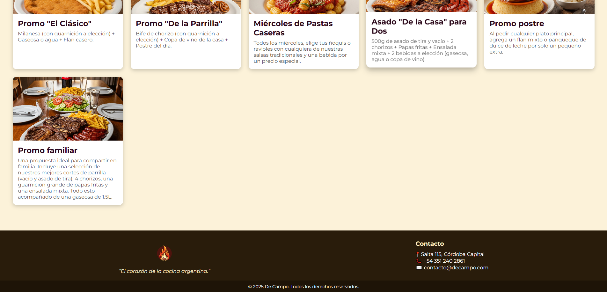

# Malbec & Grill - Sitio web para restaurante tradicional argentino

---

## Descripción

Este es un sitio web responsivo y moderno para el restaurante **Malbec & Grill**, que busca reflejar la tradición y el sabor auténtico de la gastronomía argentina. El diseño combina un estilo rústico con una experiencia de usuario amigable, mostrando el menú, postres, promociones y la historia del lugar.

---

## Características principales

- Diseño limpio y atractivo con CSS Grid y Flexbox para una estructura flexible y adaptativa.
- Secciones diferenciadas para menú, postres y promociones, cada una con tarjetas visuales.
- Barra de navegación intuitiva y un hero banner con imagen de fondo impactante.
- Sección “Sobre Nosotros” con texto e imagen para contar la historia del restaurante.
- Footer con información de contacto.
- Scroll suave para navegación agradable entre secciones.
- Uso de fuentes Google Fonts (Montserrat) para una tipografía elegante.

---

## Tecnologías utilizadas

- HTML5
- CSS3 (Grid Layout, Flexbox)
- Google Fonts
- Imágenes generadas con IA

---

## Capturas de Pantalla

---

